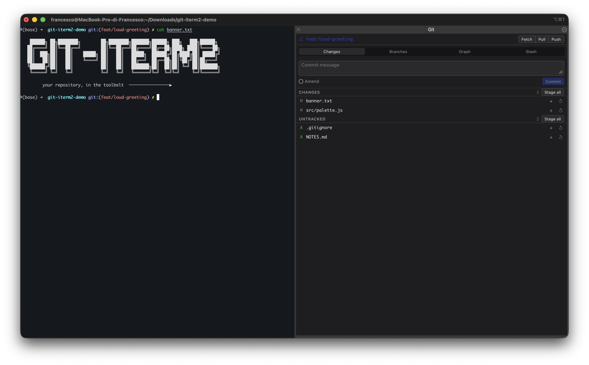
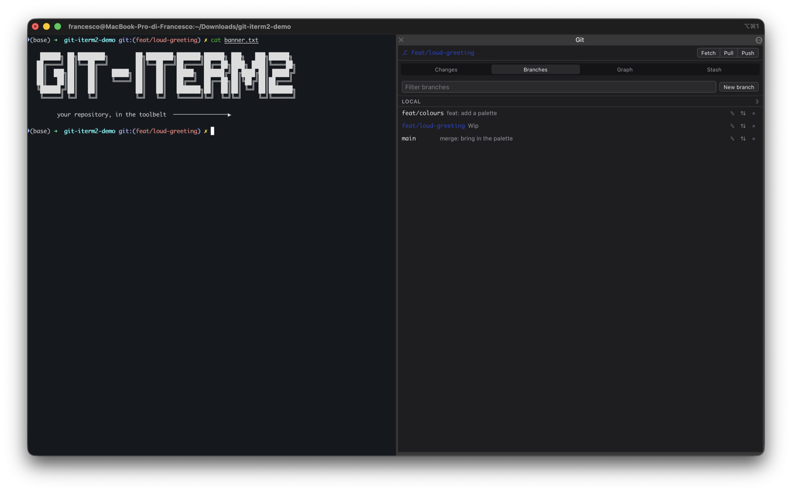
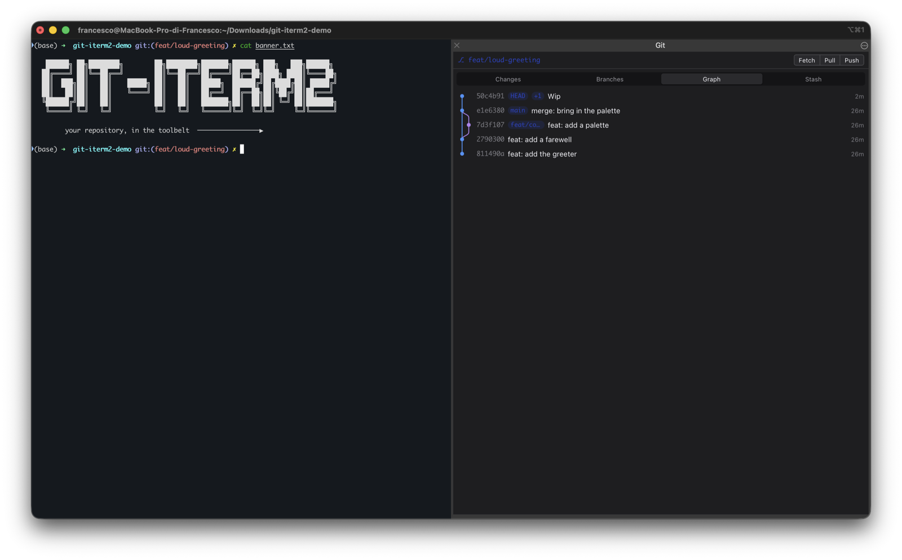

# git-iterm2

A VSCode-style Source Control panel for the iTerm2 toolbelt. It follows the git repository
of the active iTerm2 session and lets you inspect and operate on it without leaving the
terminal: branch state, staged/unstaged changes, diffs, branches, commit graph, stash and
remote operations.

Your terminal already knows which repository you are in. Now your git panel does too.



<table>
  <tr>
    <td></td>
    <td></td>
    <td></td>
  </tr>
  <tr>
    <td align="center"><sub>Branches</sub></td>
    <td align="center"><sub>Graph</sub></td>
    <td align="center"><sub>Stash</sub></td>
  </tr>
</table>

## Requirements

- macOS, with [iTerm2](https://iterm2.com) 3.5 or newer (developed and verified on 3.7.1).
- iTerm2's Python API enabled (Preferences › General › Magic › Enable Python API).
- iTerm2 [Shell Integration](https://iterm2.com/documentation-shell-integration.html)
  recommended: without it, the panel cannot tell which directory a session is in and shows
  a hint asking you to install it.

## Install

1. Download `GitPanel.zip` from the [latest release](../../releases/latest).
2. Double-click it, or run `packaging/install.sh <path-or-https-url-to-GitPanel.zip>`.
   Either way, iTerm2 opens its own script-import flow.
3. **The archive is unsigned** — there is no Apple Developer ID certificate for it. That is
   why it ships as a `.zip`: iTerm2 accepts an unsigned `.zip` from an import you start
   yourself, while `.its` requires a signature. On first import iTerm2 downloads a Python
   runtime for the script (once, a few hundred MB), then reports *Script Imported
   Successfully* with a **Launch** button.
4. **Optional, and worth the ten seconds: check where the archive came from.** Every
   release archive carries a signed [build provenance attestation][attestation] binding it
   to the commit and the GitHub Actions run that produced it. With the
   [GitHub CLI](https://cli.github.com) installed:

   ```sh
   gh attestation verify GitPanel.zip --repo FrancescoASessa/git-iterm2
   ```

   The `.sha256` published next to the archive only proves your download is intact — it is
   served from the same place as the archive, so it says nothing about who produced it. The
   attestation is what ties the file to this repository. Neither makes macOS or iTerm2 treat
   the archive as signed.
5. Press **Launch**, or later start it from **Scripts › GitPanel**.
6. Show the toolbelt — **View › Show Toolbelt** (`⇧⌘B`) — then tick **View › Toolbelt › Git**.
   These are two separate toggles: ticking the tool alone will not display the toolbelt.
7. **Make it start with iTerm2** (recommended). iTerm2 imports the script to
   `Scripts/GitPanel`, not `Scripts/AutoLaunch/`, so out of the box it does not restart when
   you relaunch iTerm2. Move it once:

   ```sh
   mkdir -p ~/Library/Application\ Support/iTerm2/Scripts/AutoLaunch
   mv ~/Library/Application\ Support/iTerm2/Scripts/GitPanel \
      ~/Library/Application\ Support/iTerm2/Scripts/AutoLaunch/
   ```

   From the next launch on, the panel is back in the toolbelt on its own. (Verified on a real
   iTerm2 3.7.1 — see [`docs/ITERM2-FINDINGS.md`](docs/ITERM2-FINDINGS.md).)

[attestation]: https://docs.github.com/en/actions/security-for-github-actions/using-artifact-attestations/using-artifact-attestations-to-establish-provenance-for-builds

To remove it later, run `packaging/uninstall.sh`. It deletes the script's files, but it
cannot untick "Git" from **View › Toolbelt** — that registration lives in iTerm2's own
preferences and persists independently of the files, so untick it there yourself.

## What it does

- **Changes** — staged, unstaged, untracked and conflicted files; stage/unstage/discard;
  commit with amend; click a file for an inline diff, double-click (or `⌥`-click) to open
  it in a new split pane running `git diff`.
- **Branches** — local and remote branches, filter, checkout (offers stash-and-checkout on
  a dirty tree), create, rename, delete, set upstream.
- **Graph** — paginated, lane-rendered commit history; click a commit for its changed files
  and per-file diff.
- **Stash** — list, push (with message, optionally including untracked files), apply, pop,
  drop.

Fetch/pull/push run with progress, and a banner with Continue/Abort appears while a merge,
rebase or cherry-pick is in progress.

## Following the active session

The panel always shows the repository of iTerm2's *currently active* session: it re-resolves
the repo root when you switch tabs/panes or `cd` inside one, via iTerm2 Shell Integration's
`path` variable. There is no way to pin a different repo independently of the active session.

## Logs

`~/Library/Logs/git-iterm2/panel.log`, rotated automatically. Verbosity is controlled by the
`GIT_ITERM2_LOG_LEVEL` environment variable (default `INFO`). The per-process auth token is
never written to this file.

## Development

The panel is a Python backend (`backend/`, served locally via aiohttp) plus a Preact/
TypeScript SPA (`web/`), packaged together into the `.zip` archive (`packaging/`). See
[`backend/README.md`](backend/README.md) and [`web/README.md`](web/README.md) for the dev
commands for each layer, and [`CONTRIBUTING.md`](CONTRIBUTING.md) for the full layout and
quality gates.

## Security

- The server binds `127.0.0.1` only, on a port the OS assigns at startup — never a fixed or
  externally reachable port.
- Every request needs a 32-byte random token generated fresh per process start; it is
  embedded in the toolbelt's own URL and never logged.
- No telemetry: the panel only runs the git commands you trigger, against your local
  checkout, using your existing git/ssh/credential-helper configuration.

## License

[MIT](LICENSE) © 2026 Francesco Sessa
